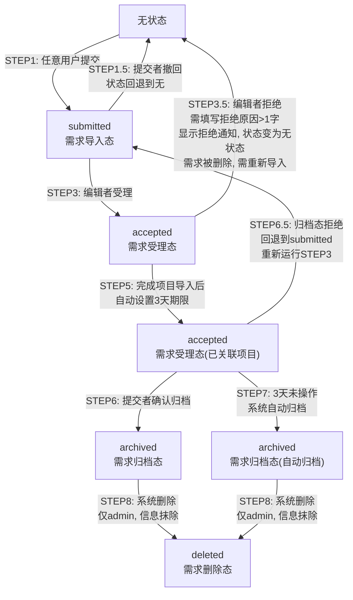

# 需求导入功能实施计划

## 一、架构分析与集成策略

### 1.1 现有架构要点

| 模块 | 文件 | 关键机制 |
|------|------|----------|
| 后端服务器 | `协作服务器_安全版.py` | `http.server.SimpleHTTPRequestHandler`，在 `do_GET`/`do_POST` 中用 `if path == '/api/xxx'` 匹配路由 |
| 认证授权 | `auth.py` | `ROLES` 定义 admin/editor/viewer，权限列表含 view/edit/delete/save/submit_approval/approve 等 |
| Excel同步 | `sync_excel.py` | 以 `超声波户表脚本.xlsx` 为唯一数据源，含「任务计划表」和「操作记录」两个 Sheet |
| 前端页面 | `更新点检表.py` | 单文件 HTML+JS，全局 `RAW_DATA` 驱动，动态创建 `.modal-overlay` 弹窗 |
| 协作数据 | `data/协作数据.json` | 存储 localEdits/notes/checked/archived 等，被 GitHub 同步覆盖 |
| 操作记录 | Excel「操作记录」Sheet | 表头：操作ID/操作时间/操作人/操作类型/项目ID列表/项目名列表/变更前内容/变更后内容/状态/关联审批ID/审批人/审批时间 |

### 1.2 集成策略

- **数据存储**：新增 `data/需求导入.json`（与 `协作数据.json` 同目录，天然被 GitHub 同步覆盖）
- **操作审计**：复用现有 Excel「操作记录」Sheet，新增 `requirement_*` 类型操作
- **弹窗复用**：通过全局上下文变量 `window._requirementAcceptCtx` 拦截 `submitNewProject()` 和 `submitImport()` 的关闭行为，使添加/导入弹窗在需求受理流程中保持打开，记录项目名后允许继续添加
- **定时任务**：在 `main()` 中启动 daemon 线程，每小时检查 `accepted` 状态需求的 3 天归档期限

---

## 二、数据模型设计

### 2.1 需求数据 JSON 结构

**文件**：`/workspace/data/需求导入.json`

```json
{
  "requirements": [
    {
      "id": "REQ-20260725-001",
      "name": "XX客户定制化需求",
      "source": "客户",
      "description": "增加Modbus协议支持，调整计量精度...",
      "status": "submitted",
      "submitter": "zhangsan",
      "submit_time": "2026-07-25T09:00:00",
      "acceptor": "",
      "accept_time": "",
      "linked_projects": [],
      "rejector": "",
      "reject_time": "",
      "reject_reason": "",
      "archive_time": "",
      "archive_type": "",
      "auto_archive_deadline": ""
    }
  ],
  "meta": {
    "last_id_date": "20260725",
    "last_id_seq": 1
  }
}
```

### 2.2 状态定义

| 状态值 | 显示名称 | 说明 |
|--------|----------|------|
| `submitted` | 需求导入 | 刚提交，无关联项目 |
| `accepted` | 需求受理 | 编辑者已受理，可能已关联项目 |
| `archived` | 需求归档 | 提交者确认合理或自动超时归档 |
| `deleted` | 需求删除 | 信息抹除（仅系统管理使用） |

### 2.3 状态流转图



---

## 二（续）、操作流程详细说明

### STEP 1：需求提交（任意用户）

```
操作人：任意已登录用户（viewer/editor/admin）
触发：点击「提交新需求」按钮
弹窗内容：
  - 需求名称 *（必填，文本输入）
  - 需求来源 *（必填，下拉：市场/客户）
  - 需求开发点描述 *（必填，多行文本）
提交后：
  - 系统生成需求ID（REQ-YYYYMMDD-NNN）
  - 状态 → submitted（需求导入态）
  - 写入 Excel 操作记录（类型：requirement_submit）
  - 提交者可随时「撤回」需求
```

### STEP 2：需求等待受理

```
当前状态：submitted（需求导入态）
可见操作：
  - 提交者：「撤回」按钮（将需求从列表移除）
  - 编辑者以上：「受理」「拒绝」按钮
  - 普通用户：仅查看
显示信息：
  - 需求ID、名称、来源、描述
  - 提交人、提交时间
  - 状态标签：黄色「待受理」
  - 关联项目：显示「-」（无关联）
```

### STEP 3：编辑者受理

```
操作人：editor / admin
触发：点击需求行上的「受理」按钮
弹出受理弹窗：
  ┌─────────────────────────────────────┐
  │ 受理需求                    [关闭]  │
  │─────────────────────────────────────│
  │ 流程说明：                          │
  │ 1. 点击下方按钮添加任务或导入项目    │
  │ 2. 可多次添加，所有项目名自动收集    │
  │ 3. 添加完成后点击「完成受理」确认    │
  │                                     │
  │ 已关联项目：（添加后在此显示标签）    │
  │   [巴西NB-V3] [印度项目]            │
  │                                     │
  │  ┌──────────┐ ┌────────────┐ ┌──────────────┐ │
  │  │ 添加项目  │ │关联已有项目│ │ 从Project导入 │ │ ← 复用现有弹窗
  │  └──────────┘ └────────────┘ └──────────────┘ │
  │                                     │
  │  [取消]              [完成受理]       │
  └─────────────────────────────────────┘
弹窗内点击「添加项目」：
  - 复用现有 openAddProjectModal() 弹窗
  - 项目添加成功后不关闭弹窗，清空表单
  - 项目名自动收集到受理弹窗的「已关联项目」列表
弹窗内点击「关联已有项目」：
  - 弹出项目选择器，列出当前系统中的所有项目名称
  - 支持搜索过滤（输入关键字实时筛选）
  - 复选框勾选/取消勾选项目
  - 已关联的项目显示为禁用状态并标记「(已关联)」
  - 勾选后项目名自动添加到受理弹窗的「已关联项目」列表
弹窗内点击「从Project导入」：
  - 复用现有 openImportModal() 弹窗
  - 支持文本粘贴、.mpp文件、PDF文件、截图
  - 导入成功后不关闭弹窗，重置预览区
  - 所有项目名自动收集到受理弹窗的「已关联项目」列表
```

### STEP 4：完成项目导入

```
触发：在受理弹窗中点击「完成受理」
后端处理（按顺序）：
  1. 调用 /api/requirement/link-projects
     → 将收集到的项目名列表关联到需求
     → 状态仍为 submitted
  2. 调用 /api/requirement/accept
     → 状态 → accepted（需求受理态）
     → 记录受理人、受理时间
     → 设置 auto_archive_deadline = 受理时间 + 3天
     → 写入 Excel 操作记录（类型：requirement_accept）
完成后：
  - 受理弹窗关闭
  - 需求列表刷新，该需求显示为蓝色「已受理」标签
  - 关联项目列显示已关联的项目名称
  - 导入的项目同时写入项目看板（现有逻辑不变）
```

### STEP 5：需求受理完成态

```
当前状态：accepted（需求受理态）
显示变化：
  - 状态标签：蓝色「已受理」
  - 关联项目列：显示已关联的项目名（逗号分隔）
  - 受理人、受理时间
可见操作：
  - 需求提交者本人：「归档」按钮
  - editor/admin：「归档」按钮 + 「回退」按钮
  - 普通用户：仅查看
回退说明：
  - 点击「回退」后弹出确认框
  - 回退后状态变为 submitted（需求导入态），清除受理人/受理时间/归档期限
  - 保留已关联的项目名（不清除）
  - 回到 STEP 3，编辑者可重新受理
后台计时：
  - 从受理时间开始，3天内未归档则自动执行 STEP 7
```

### STEP 6：提交者确认归档

```
操作人：需求提交者本人 或 editor/admin
触发：点击「归档」按钮
确认弹窗：
  - confirm("确认该需求的计划合理，执行归档？")
后端处理：
  - 状态 → archived（需求归档态）
  - archive_type = "manual"（手动归档）
  - 记录归档时间
  - 写入 Excel 操作记录（类型：requirement_archive）
完成后：
  - 需求列表刷新，该需求显示为灰色「已归档」标签
  - 操作列显示「已完成」
```

### STEP 6.5：归档态拒绝（回退到受理）

```
操作人：editor / admin
触发：点击已归档需求行上的「拒绝」按钮
输入弹窗：
  - prompt("请输入拒绝原因（将回退到需求导入阶段重新受理）：")
  - 约束：拒绝原因必须大于1个字（>1个字符）
后端处理：
  - 状态 → submitted（回退到需求导入态）
  - 记录拒绝人、拒绝时间、拒绝原因
  - 清除归档时间和归档类型
  - 保留已关联的项目名（不清除）
  - 写入 Excel 操作记录（类型：requirement_reject，变更后含拒绝原因）
完成后：
  - 需求回到待受理状态
  - 循环至 STEP 3，编辑者可重新受理
```

### STEP 7：3天超时自动归档

```
触发条件：accepted 状态 + auto_archive_deadline <= 当前时间
执行者：系统（daemon 线程，每小时检查一次）
后端处理：
  - 状态 → archived（需求归档态）
  - archive_type = "auto"（自动归档）
  - 记录归档时间
  - 写入 Excel 操作记录（类型：requirement_auto_archive，原因："3天未确认"）
  - 触发 GitHub 同步
注意：
  - 服务器重启后会立即检查并归档所有超期需求，不会遗漏
```

### STEP 3.5：编辑者拒绝（受理阶段）

```
操作人：editor / admin
触发：点击「拒绝」按钮
输入弹窗：
  - prompt("请输入拒绝原因（将删除该需求）：")
  - 约束：拒绝原因必须大于1个字（>1个字符）
后端处理：
  - 状态 → deleted（需求删除态）
  - 记录拒绝人、拒绝时间、拒绝原因
  - 清除关联的项目名
  - 写入 Excel 操作记录（类型：requirement_reject，变更后含拒绝原因）
完成后：
  - 向提交者显示「需求被拒绝」通知，包含拒绝原因
  - 需求从列表移除（状态变为 deleted）
  - 需求被删除，提交者需重新导入需求（回到 STEP1）
```

### STEP 8：需求删除（系统管理）

```
操作人：admin（仅系统管理员）
触发：点击需求行上的「删除」按钮
确认弹窗：
  - confirm("确定删除该需求？此操作不可恢复，信息将被抹除。")
后端处理：
  - 状态 → deleted（需求删除态）
  - name/description/source 等字段替换为 [已删除]
  - 写入 Excel 操作记录（类型：requirement_delete）
注意：
  - 删除不强制在控制流程中，属于系统管理行为
  - 需求导入流程的正常终结点是「归档」而非「删除」
```

---

## 三、后端 API 设计

所有新增路由位于 `协作服务器_安全版.py` 的 `SecureCollaborationHandler` 类中。

### 3.1 API 清单

| 方法 | 路径 | 权限 | 功能 |
|------|------|------|------|
| GET | `/api/requirements` | 已登录 | 获取需求列表，支持 `?status=` 过滤 |
| POST | `/api/requirement/submit` | 已登录（任意角色） | 提交新需求 |
| POST | `/api/requirement/accept` | `edit` | 受理需求，状态变为 accepted，设置 3 天归档期限 |
| POST | `/api/requirement/reject` | `edit` | 拒绝需求，状态回退为 submitted |
| POST | `/api/requirement/archive` | 本人 或 `edit` | 提交者确认归档 |
| POST | `/api/requirement/revert` | `edit` | 回退已受理需求到 submitted（仅 editor/admin） |
| POST | `/api/requirement/delete` | `delete` | 抹除需求信息（仅 admin） |
| POST | `/api/requirement/link-projects` | `edit` | 受理完成后关联项目名称 |

### 3.2 请求/响应定义

**GET /api/requirements**

- Query: `?status=submitted|accepted|archived|deleted`（可选）
- Response: `{"success": true, "requirements": [...]}`

**POST /api/requirement/submit**

- Body: `{"name": "...", "source": "市场|客户", "description": "..."}`
- Response: `{"success": true, "message": "提交成功", "requirement": {...}}`

**POST /api/requirement/accept**

- Body: `{"id": "REQ-20260725-001"}`
- Response: `{"success": true, "message": "已受理"}`

**POST /api/requirement/reject**

- Body: `{"id": "REQ-20260725-001", "reason": "资源不足"}`
- Response: `{"success": true, "message": "已拒绝并回退"}`

**POST /api/requirement/archive**

- Body: `{"id": "REQ-20260725-001"}`
- Response: `{"success": true, "message": "已归档"}`

**POST /api/requirement/delete**

- Body: `{"id": "REQ-20260725-001"}`
- Response: `{"success": true, "message": "已删除"}`

**POST /api/requirement/link-projects**

- Body: `{"id": "REQ-20260725-001", "project_names": ["巴西NB-V3", "印度项目"]}`
- Response: `{"success": true, "message": "已关联 2 个项目"}`

### 3.3 后端辅助函数（新增于 `协作服务器_安全版.py` 顶部）

在 `load_data()` / `save_data()` 附近新增：

```python
REQ_FILE = os.path.join(DATA_DIR, '需求导入.json')

def load_requirements():
    if not os.path.exists(REQ_FILE):
        return {'requirements': [], 'meta': {'last_id_date': '', 'last_id_seq': 0}}
    try:
        with open(REQ_FILE, 'r', encoding='utf-8') as f:
            return json.load(f)
    except:
        return {'requirements': [], 'meta': {'last_id_date': '', 'last_id_seq': 0}}

def save_requirements(data):
    with open(REQ_FILE, 'w', encoding='utf-8') as f:
        json.dump(data, f, ensure_ascii=False, indent=2)

def _generate_req_id(meta):
    from datetime import datetime
    today = datetime.now().strftime('%Y%m%d')
    if meta.get('last_id_date') != today:
        meta['last_id_date'] = today
        meta['last_id_seq'] = 0
    meta['last_id_seq'] += 1
    return f"REQ-{today}-{meta['last_id_seq']:03d}"

def _log_requirement_operation(op_type, operator, req_name, before_data, after_data):
    """写需求操作到 Excel 操作记录 Sheet"""
    op_data = {
        '操作时间': datetime.now().isoformat(),
        '操作人': operator,
        '操作类型': op_type,
        '项目ID列表': [],
        '项目名列表': [req_name],
        '变更前内容': before_data,
        '变更后内容': after_data,
        '状态': 'direct',
    }
    sync_excel._append_operation(op_data)
```

### 3.4 路由实现位置

在 `协作服务器_安全版.py` 的 `do_GET` 方法中，在 `if path == '/api/operations/list':` 之后、`# 其他静态文件` 之前插入：

```python
        # --- API: 需求导入列表（需已登录）---
        if path == '/api/requirements':
            if not self.require_auth():
                return
            query = urllib.parse.parse_qs(parsed.query)
            status_filter = query.get('status', [''])[0]
            data = load_requirements()
            reqs = data.get('requirements', [])
            if status_filter:
                reqs = [r for r in reqs if r.get('status') == status_filter]
            self.send_json({'success': True, 'requirements': reqs})
            return
```

在 `do_POST` 方法中，在 `if path == '/api/pull-github':` 之后、方法结束前插入 7 个新端点。

**受理端点关键逻辑**：

```python
        if path == '/api/requirement/accept':
            if not self.require_permission('edit'):
                return
            user = self.get_current_user()
            req_id = data.get('id', '')
            req_data = load_requirements()
            req = next((r for r in req_data['requirements'] if r['id'] == req_id), None)
            if not req:
                self.send_json({'success': False, 'message': '需求不存在'})
                return
            if req['status'] != 'submitted':
                self.send_json({'success': False, 'message': '需求不是待受理状态'})
                return
            from datetime import datetime, timedelta
            now = datetime.now()
            req['status'] = 'accepted'
            req['acceptor'] = user['username']
            req['accept_time'] = now.isoformat()
            req['auto_archive_deadline'] = (now + timedelta(days=3)).isoformat()
            save_requirements(req_data)
            _log_requirement_operation('requirement_accept', user['username'], req['name'],
                                       {'status': 'submitted'}, {'status': 'accepted'})
            self.send_json({'success': True, 'message': '已受理，请在3天内完成任务导入并确认'})
            return
```

**拒绝端点关键逻辑**：

```python
        if path == '/api/requirement/reject':
            if not self.require_permission('edit'):
                return
            # ... 状态回退为 submitted，记录 rejector/reject_time/reject_reason
```

**归档端点关键逻辑**：

```python
        if path == '/api/requirement/archive':
            if not self.require_auth():
                return
            user = self.get_current_user()
            req_id = data.get('id', '')
            req_data = load_requirements()
            req = next(...)
            # 权限检查：本人 或 editor/admin
            if req['submitter'] != user['username'] and not auth.has_permission(user['username'], 'edit'):
                self.send_json({'success': False, 'message': '权限不足'}, 403)
                return
            req['status'] = 'archived'
            req['archive_time'] = datetime.now().isoformat()
            req['archive_type'] = 'manual'
            save_requirements(req_data)
            _log_requirement_operation('requirement_archive', ...)
            self.send_json({'success': True, 'message': '已归档'})
            return
```

### 3.5 定时自动归档任务

在 `协作服务器_安全版.py` 的 `main()` 函数中，在 `auth.auto_sync_periodically(30 * 60)` 之后插入：

```python
    # 需求自动归档定时任务（每小时检查一次）
    def _auto_archive_requirements():
        while True:
            time.sleep(3600)
            try:
                from datetime import datetime
                req_data = load_requirements()
                now = datetime.now().isoformat()
                changed = False
                for req in req_data.get('requirements', []):
                    if req.get('status') == 'accepted' and req.get('auto_archive_deadline'):
                        if req['auto_archive_deadline'] <= now:
                            req['status'] = 'archived'
                            req['archive_time'] = now
                            req['archive_type'] = 'auto'
                            changed = True
                            _log_requirement_operation(
                                'requirement_auto_archive', 'system', req['name'],
                                {'status': 'accepted'}, {'status': 'archived', '原因': '3天未确认'}
                            )
                if changed:
                    save_requirements(req_data)
                    auth.sync_to_github('需求自动归档')
            except Exception as e:
                print(f'[自动归档] 检查失败: {e}')
    
    threading.Thread(target=_auto_archive_requirements, daemon=True).start()
```

---

## 四、前端改动设计

所有改动位于 `/workspace/更新点检表.py`。

### 4.1 新增 Tab

在 HTML 的 tabs 区域（约第 1300-1304 行）：

```html
  <div class="tabs" id="tabs">
    <div class="tab" data-tab="delayed">延期预警 <span class="badge" id="tabDelayedCount">0</span></div>
    <div class="tab active" data-tab="all">全部项目 <span class="badge" id="tabAllCount">0</span></div>
    <div class="tab" data-tab="byDept">按市场 <span class="badge" id="tabDeptCount">0</span></div>
    <div class="tab" data-tab="archived">已归档 <span class="badge" id="tabArchivedCount">0</span></div>
    <div class="tab" data-tab="requirements">需求导入 <span class="badge" id="tabReqCount">0</span></div>
  </div>
```

### 4.2 Tab 切换逻辑改造

在 `bindEvents()` 函数中（约第 2484-2491 行），现有 tab click 事件不变，在 `renderTable()` 调用前增加：

```javascript
  document.querySelectorAll('.tab').forEach(tab => {
    tab.addEventListener('click', () => {
      document.querySelectorAll('.tab').forEach(t => t.classList.remove('active'));
      tab.classList.add('active');
      currentTab = tab.dataset.tab;
      if (currentTab === 'requirements') {
        renderRequirements();
      } else {
        renderTable();
      }
    });
  });
```

### 4.3 需求列表渲染函数

新增 `renderRequirements()` 函数：

```javascript
async function renderRequirements() {
  const container = document.getElementById('tableContainer');
  const currentUser = getCurrentUser();
  const username = currentUser ? currentUser.username : '';
  const canEdit = canEditDirectly();
  const canDel = canDelete();
  
  try {
    const resp = await fetch('/api/requirements');
    if (!resp.ok) throw new Error('加载失败');
    const data = await resp.json();
    const reqs = data.requirements || [];
    
    // 更新 badge
    const pendingCount = reqs.filter(r => r.status === 'submitted').length;
    document.getElementById('tabReqCount').textContent = pendingCount;
    
    let html = `
      <div style="margin-bottom:16px">
        <button class="btn" style="background:#ec4899;color:white" onclick="openSubmitRequirementModal()">提交新需求</button>
      </div>
      <table style="width:100%;border-collapse:collapse;font-size:13px">
        <thead style="background:#f3f4f6;position:sticky;top:0">
          <tr>
            <th style="padding:10px;text-align:left">需求ID</th>
            <th style="padding:10px;text-align:left">名称</th>
            <th style="padding:10px;text-align:left">来源</th>
            <th style="padding:10px;text-align:left">描述</th>
            <th style="padding:10px;text-align:left">状态</th>
            <th style="padding:10px;text-align:left">提交人</th>
            <th style="padding:10px;text-align:left">关联项目</th>
            <th style="padding:10px;text-align:center">操作</th>
          </tr>
        </thead>
        <tbody>
    `;
    
    const statusMap = {
      submitted: { text: '待受理', color: '#f59e0b', bg: '#fef3c7' },
      accepted: { text: '已受理', color: '#3b82f6', bg: '#dbeafe' },
      archived: { text: '已归档', color: '#6b7280', bg: '#f3f4f6' },
      deleted: { text: '已删除', color: '#ef4444', bg: '#fee2e2' }
    };
    
    reqs.forEach(req => {
      const st = statusMap[req.status] || statusMap.submitted;
      const linked = (req.linked_projects || []).join(', ') || '-';
      let actions = '';
      
      if (req.status === 'submitted') {
        if (canEdit) {
          actions += `<button class="btn btn-success" style="padding:4px 10px;font-size:12px" onclick="openAcceptRequirementModal('${req.id}')">受理</button> `;
          actions += `<button class="btn btn-secondary" style="padding:4px 10px;font-size:12px" onclick="rejectRequirement('${req.id}')">拒绝</button>`;
        } else {
          actions += '<span style="color:#9ca3af;font-size:12px">等待受理</span>';
        }
      } else if (req.status === 'accepted') {
        if (req.submitter === username || canEdit) {
          actions += `<button class="btn" style="background:#8b5cf6;color:white;padding:4px 10px;font-size:12px" onclick="archiveRequirement('${req.id}')">归档</button>`;
        }
        if (canEdit && req.linked_projects && req.linked_projects.length > 0) {
          actions += ` <span style="color:#3b82f6;font-size:12px">已关联${req.linked_projects.length}个项目</span>`;
        }
      } else if (req.status === 'archived') {
        actions += '<span style="color:#6b7280;font-size:12px">已完成</span>';
      }
      
      if (canDel && req.status !== 'deleted') {
        actions += ` <button class="btn btn-secondary" style="padding:4px 10px;font-size:12px" onclick="deleteRequirement('${req.id}')">删除</button>`;
      }
      
      html += `
        <tr style="border-bottom:1px solid #f3f4f6">
          <td style="padding:10px;font-family:monospace;font-size:12px">${req.id}</td>
          <td style="padding:10px;font-weight:600">${escapeHtml(req.name)}</td>
          <td style="padding:10px">${escapeHtml(req.source)}</td>
          <td style="padding:10px;max-width:300px;overflow:hidden;text-overflow:ellipsis">${escapeHtml(req.description)}</td>
          <td style="padding:10px"><span style="background:${st.bg};color:${st.color};padding:2px 8px;border-radius:10px;font-size:12px;font-weight:600">${st.text}</span></td>
          <td style="padding:10px">${req.submitter}</td>
          <td style="padding:10px;font-size:12px;color:#6b7280">${escapeHtml(linked)}</td>
          <td style="padding:10px;text-align:center;white-space:nowrap">${actions}</td>
        </tr>
      `;
    });
    
    html += '</tbody></table>';
    if (reqs.length === 0) {
      html += '<div style="text-align:center;color:#9ca3af;padding:60px">暂无需求记录</div>';
    }
    container.innerHTML = html;
  } catch (e) {
    container.innerHTML = `<div style="text-align:center;color:#ef4444;padding:40px">加载失败：${e.message}</div>`;
  }
}
```

### 4.4 提交需求弹窗

新增 `openSubmitRequirementModal()` 函数：

```javascript
function openSubmitRequirementModal() {
  const modal = document.createElement('div');
  modal.className = 'modal-overlay';
  modal.innerHTML = `
    <div class="modal-box" style="max-width:560px">
      <button class="modal-close" onclick="this.closest('.modal-overlay').remove()">×</button>
      <h3>提交新需求</h3>
      <div class="form-group">
        <label>需求名称 *</label>
        <input type="text" id="reqName" placeholder="如：XX客户定制化功能">
      </div>
      <div class="form-group">
        <label>需求来源 *</label>
        <select id="reqSource">
          <option value="">请选择</option>
          <option value="市场">市场</option>
          <option value="客户">客户</option>
        </select>
      </div>
      <div class="form-group">
        <label>需求开发点描述 *</label>
        <textarea id="reqDesc" rows="4" placeholder="描述具体的开发点、功能调整或Bug修复需求..."></textarea>
      </div>
      <div class="form-actions">
        <button class="btn btn-secondary" onclick="this.closest('.modal-overlay').remove()">取消</button>
        <button class="btn btn-success" onclick="submitRequirement()">提交</button>
      </div>
    </div>
  `;
  document.body.appendChild(modal);
}

async function submitRequirement() {
  const name = document.getElementById('reqName').value.trim();
  const source = document.getElementById('reqSource').value;
  const desc = document.getElementById('reqDesc').value.trim();
  if (!name) { alert('请填写需求名称'); return; }
  if (!source) { alert('请选择需求来源'); return; }
  if (!desc) { alert('请填写需求开发点描述'); return; }
  
  try {
    const resp = await fetch('/api/requirement/submit', {
      method: 'POST',
      headers: { 'Content-Type': 'application/json' },
      body: JSON.stringify({ name, source, description: desc })
    });
    const result = await resp.json();
    if (result.success) {
      document.querySelector('.modal-overlay').remove();
      alert('需求提交成功');
      if (currentTab === 'requirements') renderRequirements();
    } else {
      alert('提交失败：' + (result.message || '未知错误'));
    }
  } catch (e) {
    alert('网络错误：' + e.message);
  }
}
```

### 4.5 受理弹窗（核心流程控制）

新增 `openAcceptRequirementModal(reqId)` 函数：

```javascript
function openAcceptRequirementModal(reqId) {
  // 初始化全局上下文
  window._requirementAcceptCtx = { reqId, projectNames: [] };
  
  const modal = document.createElement('div');
  modal.id = 'acceptReqOverlay';
  modal.className = 'modal-overlay';
  modal.innerHTML = `
    <div class="modal-box" style="max-width:600px">
      <button class="modal-close" onclick="closeAcceptRequirementModal()">×</button>
      <h3>受理需求</h3>
      <div style="background:#f0f9ff;border:1px solid #bae6fd;border-radius:8px;padding:12px;margin-bottom:16px;font-size:13px;color:#0369a1">
        <strong>流程说明：</strong><br>
        1. 点击下方按钮添加任务或导入项目<br>
        2. 可多次添加，所有项目名将自动收集<br>
        3. 添加完成后点击「完成受理」确认
      </div>
      <div id="reqLinkedProjects" style="margin-bottom:16px;display:none">
        <label style="font-size:13px;font-weight:600">已关联项目：</label>
        <div id="reqLinkedProjectsList" style="margin-top:6px;display:flex;flex-wrap:wrap;gap:6px"></div>
      </div>
      <div style="display:flex;gap:10px;margin-bottom:16px">
        <button class="btn" style="background:#ec4899;color:white;flex:1" onclick="openAddProjectModal()">添加项目</button>
        <button class="btn" style="background:#8b5cf6;color:white;flex:1" onclick="openImportModal()">从Project导入</button>
      </div>
      <div class="form-actions">
        <button class="btn btn-secondary" onclick="closeAcceptRequirementModal()">取消</button>
        <button class="btn btn-success" onclick="finishAcceptRequirement('${reqId}')">完成受理</button>
      </div>
    </div>
  `;
  document.body.appendChild(modal);
}

function closeAcceptRequirementModal() {
  window._requirementAcceptCtx = null;
  const overlay = document.getElementById('acceptReqOverlay');
  if (overlay) overlay.remove();
}

function updateAcceptProjectList() {
  const ctx = window._requirementAcceptCtx;
  if (!ctx || ctx.projectNames.length === 0) return;
  const container = document.getElementById('reqLinkedProjects');
  const list = document.getElementById('reqLinkedProjectsList');
  if (container) container.style.display = 'block';
  if (list) {
    list.innerHTML = ctx.projectNames.map(n => 
      `<span style="background:#dbeafe;color:#1e40af;padding:4px 10px;border-radius:6px;font-size:12px">${escapeHtml(n)}</span>`
    ).join('');
  }
}
```

### 4.6 弹窗复用改造

**改造 `submitNewProject()`**（约第 5845-5893 行）：

在协作模式成功分支中，将原来的：

```javascript
        document.querySelector('.modal-overlay').remove();
        if (result.need_approval) { ... } else { ... }
```

改为：

```javascript
        if (window._requirementAcceptCtx) {
          window._requirementAcceptCtx.projectNames.push(projName);
          updateAcceptProjectList();
          // 清空表单继续添加，不关闭弹窗
          document.getElementById('newProjName').value = '';
          document.getElementById('newProjDesc').value = '';
          document.getElementById('newResType').value = '';
          document.getElementById('newResPerson').value = '';
          document.getElementById('newStartDate').value = '';
          document.getElementById('newEndDate').value = '';
          alert(`已添加项目：${projName}，可继续添加`);
        } else {
          document.querySelector('.modal-overlay').remove();
          if (result.need_approval) { ... } else { ... }
        }
```

**改造 `submitImport()`**（约第 5636-5648 行）：

将原来的：

```javascript
      const overlay = document.querySelector('.modal-overlay');
      if (overlay) overlay.remove();
      alert(`成功导入 ${result.count || finalRows.length} 条数据`);
```

改为：

```javascript
      if (window._requirementAcceptCtx) {
        const names = [...new Set(finalRows.map(r => r['项目']).filter(Boolean))];
        window._requirementAcceptCtx.projectNames.push(...names);
        updateAcceptProjectList();
        // 重置预览，不关闭弹窗
        importParsedData = [];
        document.getElementById('importPreviewArea').style.display = 'none';
        document.getElementById('importDeptRow').style.display = 'none';
        document.getElementById('importWarnings').style.display = 'none';
        const textArea = document.getElementById('importTextArea');
        if (textArea) textArea.value = '';
        alert(`已导入 ${names.length} 个项目，可继续添加`);
      } else {
        const overlay = document.querySelector('.modal-overlay');
        if (overlay) overlay.remove();
        alert(`成功导入 ${result.count || finalRows.length} 条数据`);
      }
```

### 4.7 完成受理与操作函数

新增 `finishAcceptRequirement()` 及状态操作函数：

```javascript
async function finishAcceptRequirement(reqId) {
  const ctx = window._requirementAcceptCtx;
  if (!ctx) return;
  
  try {
    // 1. 先关联项目
    const uniqueNames = [...new Set(ctx.projectNames)];
    if (uniqueNames.length > 0) {
      const linkResp = await fetch('/api/requirement/link-projects', {
        method: 'POST',
        headers: { 'Content-Type': 'application/json' },
        body: JSON.stringify({ id: reqId, project_names: uniqueNames })
      });
      const linkResult = await linkResp.json();
      if (!linkResult.success) {
        alert('关联项目失败：' + linkResult.message);
        return;
      }
    }
    
    // 2. 标记受理完成
    const resp = await fetch('/api/requirement/accept', {
      method: 'POST',
      headers: { 'Content-Type': 'application/json' },
      body: JSON.stringify({ id: reqId })
    });
    const result = await resp.json();
    if (result.success) {
      closeAcceptRequirementModal();
      alert('需求已受理完成');
      if (currentTab === 'requirements') renderRequirements();
    } else {
      alert('受理失败：' + (result.message || '未知错误'));
    }
  } catch (e) {
    alert('网络错误：' + e.message);
  }
}

async function rejectRequirement(reqId) {
  const reason = prompt('请输入拒绝原因（将回退到需求导入阶段）：');
  if (reason === null) return;
  try {
    const resp = await fetch('/api/requirement/reject', {
      method: 'POST',
      headers: { 'Content-Type': 'application/json' },
      body: JSON.stringify({ id: reqId, reason: reason || '' })
    });
    const result = await resp.json();
    if (result.success) {
      alert('已拒绝并回退');
      if (currentTab === 'requirements') renderRequirements();
    } else {
      alert(result.message);
    }
  } catch (e) {
    alert('网络错误');
  }
}

async function archiveRequirement(reqId) {
  if (!confirm('确认该需求的计划合理，执行归档？')) return;
  try {
    const resp = await fetch('/api/requirement/archive', {
      method: 'POST',
      headers: { 'Content-Type': 'application/json' },
      body: JSON.stringify({ id: reqId })
    });
    const result = await resp.json();
    if (result.success) {
      alert('已归档');
      if (currentTab === 'requirements') renderRequirements();
    } else {
      alert(result.message);
    }
  } catch (e) {
    alert('网络错误');
  }
}

async function deleteRequirement(reqId) {
  if (!confirm('确定删除该需求？此操作不可恢复，信息将被抹除。')) return;
  try {
    const resp = await fetch('/api/requirement/delete', {
      method: 'POST',
      headers: { 'Content-Type': 'application/json' },
      body: JSON.stringify({ id: reqId })
    });
    const result = await resp.json();
    if (result.success) {
      alert('已删除');
      if (currentTab === 'requirements') renderRequirements();
    } else {
      alert(result.message);
    }
  } catch (e) {
    alert('网络错误');
  }
}
```

---

## 五、Excel 操作记录结构

复用现有 `sync_excel.py` 的 `_append_operation()` 函数，新增以下操作类型：

| 操作类型 | 触发时机 | 变更前内容 | 变更后内容 |
|----------|----------|------------|------------|
| `requirement_submit` | 提交需求 | `{}` | `{"status": "submitted"}` |
| `requirement_accept` | 受理需求 | `{"status": "submitted"}` | `{"status": "accepted"}` |
| `requirement_reject` | 拒绝需求 | `{"status": "accepted"}` | `{"status": "submitted", "拒绝原因": "..."}` |
| `requirement_link_projects` | 关联项目 | `{"linked_projects": []}` | `{"linked_projects": ["巴西NB"]}` |
| `requirement_archive` | 手动归档 | `{"status": "accepted"}` | `{"status": "archived"}` |
| `requirement_auto_archive` | 自动归档 | `{"status": "accepted"}` | `{"status": "archived", "原因": "3天未确认"}` |
| `requirement_delete` | 删除需求 | `{"status": "..."}` | `{"status": "deleted"}` |

所有需求相关操作的：
- **项目ID列表**：固定为 `[]`
- **项目名列表**：`[需求名称]`
- **状态**：`direct`（需求流程不走审批系统，直接生效）
- **关联审批ID/审批人/审批时间**：留空

---

## 六、权限控制矩阵

| 功能 | 所需权限 | 检查方式 |
|------|----------|----------|
| 查看需求列表 | 已登录 | `require_auth()` |
| 提交需求 | 已登录 | `require_auth()`（viewer/editor/admin 均可） |
| 受理需求 | `edit` | `require_permission('edit')`（editor/admin） |
| 拒绝需求 | `edit` | `require_permission('edit')`（editor/admin） |
| 归档需求 | 本人 或 `edit` | 代码内判断 `req.submitter == username` 或 `has_permission('edit')` |
| 回退需求 | `edit` | `require_permission('edit')`（editor/admin） |
| 删除需求 | `delete` | `require_permission('delete')`（仅 admin） |
| 关联项目 | `edit` | `require_permission('edit')`（editor/admin） |

---

## 七、详细实施步骤

### 步骤 1：数据层实现

**目标文件**：`协作服务器_安全版.py`

1. 在文件顶部 `DATA_FILE` 定义之后，新增：
   - `REQ_FILE = os.path.join(DATA_DIR, '需求导入.json')`
   - `load_requirements()` 函数
   - `save_requirements(data)` 函数
   - `_generate_req_id(meta)` 函数
   - `_log_requirement_operation(...)` 函数

2. 在 `main()` 函数中，在 `auth.auto_sync_periodically(30 * 60)` 之后，新增并启动 `_auto_archive_requirements` daemon 线程。

### 步骤 2：后端 API 实现

**目标文件**：`协作服务器_安全版.py`

1. 在 `do_GET` 方法中，`/api/operations/list` 路由之后，新增 `/api/requirements` 路由处理。

2. 在 `do_POST` 方法末尾（`if path == '/api/pull-github':` 之后），按顺序插入 7 个新端点：
   - `/api/requirement/submit`
   - `/api/requirement/accept`
   - `/api/requirement/reject`
   - `/api/requirement/archive`
   - `/api/requirement/delete`
   - `/api/requirement/link-projects`

3. 每个端点严格遵循现有代码模式：权限检查 -> 参数校验 -> 业务逻辑 -> 写操作记录 -> `self.send_json()` 返回。

### 步骤 3：前端 Tab 与列表渲染

**目标文件**：`更新点检表.py`

1. 在 HTML tabs 区域，已归档 tab 之后新增需求导入 tab。

2. 在 `bindEvents()` 中，修改 tab click 处理逻辑，增加 `currentTab === 'requirements'` 分支调用 `renderRequirements()`。

3. 在 `<script>` 区域新增 `renderRequirements()`、`openSubmitRequirementModal()`、`submitRequirement()`、`openAcceptRequirementModal()`、`closeAcceptRequirementModal()`、`updateAcceptProjectList()`、`finishAcceptRequirement()`、`rejectRequirement()`、`archiveRequirement()`、`deleteRequirement()` 函数。

### 步骤 4：弹窗复用改造

**目标文件**：`更新点检表.py`

1. 修改 `submitNewProject()` 中协作模式成功后的弹窗关闭逻辑：当 `window._requirementAcceptCtx` 存在时，记录项目名、更新列表、清空表单、不关闭弹窗。

2. 修改 `submitImport()` 中导入成功后的弹窗关闭逻辑：当 `window._requirementAcceptCtx` 存在时，收集项目名、更新列表、重置预览区域、不关闭弹窗。

3. 确保两处修改均在原有 `else` 分支中保留原逻辑，保证非需求受理流程的正常使用不受影响。

### 步骤 5：Excel 操作记录集成

**目标文件**：`协作服务器_安全版.py`（已完成于步骤 1 的 `_log_requirement_operation`）

1. 确认 `_log_requirement_operation` 在每个端点的状态变更后都被调用。
2. 确认 `sync_excel._append_operation()` 的调用参数与现有「操作记录」Sheet 表头兼容。

### 步骤 6：联调与边界处理

1. **非协作模式兼容**：在 `renderRequirements()` 及所有操作函数开头检查 `collabIsEnabled()`，非协作模式下显示提示"需求导入功能需在协作模式下使用"。

2. **空数据初始化**：首次启动时 `data/需求导入.json` 不存在，`load_requirements()` 返回空结构，无需额外初始化。

3. **并发安全**：JSON 文件读写未加锁，但由于 Python GIL 和 `http.server` 的单线程请求处理模型（`ThreadingTCPServer` 虽多线程但每个请求独立），需求数据的操作原子性由单次请求内完成读写保证。如需增强，可参考 `auth.py` 的 `_lock` 模式添加 `threading.Lock()`。

4. **GitHub 同步**：`save_requirements()` 后手动调用 `auth.sync_to_github()` 或在关键操作后触发同步，确保数据持久化。

---

## 八、文件修改清单

| 文件 | 修改类型 | 改动内容 |
|------|----------|----------|
| `/workspace/协作服务器_安全版.py` | 新增函数 | `load_requirements`, `save_requirements`, `_generate_req_id`, `_log_requirement_operation`, `_auto_archive_requirements` |
| `/workspace/协作服务器_安全版.py` | 新增路由 | `do_GET` 中 `/api/requirements`；`do_POST` 中 6 个需求端点 |
| `/workspace/协作服务器_安全版.py` | 修改 | `main()` 中启动自动归档线程 |
| `/workspace/更新点检表.py` | 修改 HTML | tabs 区域新增需求导入 tab |
| `/workspace/更新点检表.py` | 修改 JS | `bindEvents()` tab 切换逻辑 |
| `/workspace/更新点检表.py` | 修改 JS | `submitNewProject()` 弹窗关闭逻辑 |
| `/workspace/更新点检表.py` | 修改 JS | `submitImport()` 弹窗关闭逻辑 |
| `/workspace/更新点检表.py` | 新增 JS | `renderRequirements` 及全部需求操作函数 |
| `/workspace/data/需求导入.json` | 新增文件 | 运行时自动生成，无需预创建 |

---

## 九、风险与注意事项

1. **弹窗层级**：`openAddProjectModal()` / `openImportModal()` 创建的弹窗会覆盖在受理弹窗之上。关闭添加/导入弹窗后受理弹窗仍在，用户体验良好。但 `document.querySelector('.modal-overlay').remove()` 只会移除最上层的一个弹窗，改造后需确保正确判断 `_requirementAcceptCtx` 存在时不执行 remove。

2. **项目名收集**：从 Project 导入时，通过 `finalRows.map(r => r['项目'])` 收集项目名，去重后写入需求记录。如果导入的数据未正确填写「项目」列，可能导致关联为空。

3. **3 天自动归档**：以 `accept_time + 3天` 为期限，每小时检查一次。如果服务器在 3 天内未运行，重启后会立即检查并归档超期需求，不会遗漏。

4. **删除与抹除**：当前设计将 `deleted` 状态的需求保留在 JSON 中但标记为已删除。如需真正抹除敏感信息，可在 `delete` 端点中将 `name`/`description`/`source` 等字段清空或替换为 `[已删除]`。
